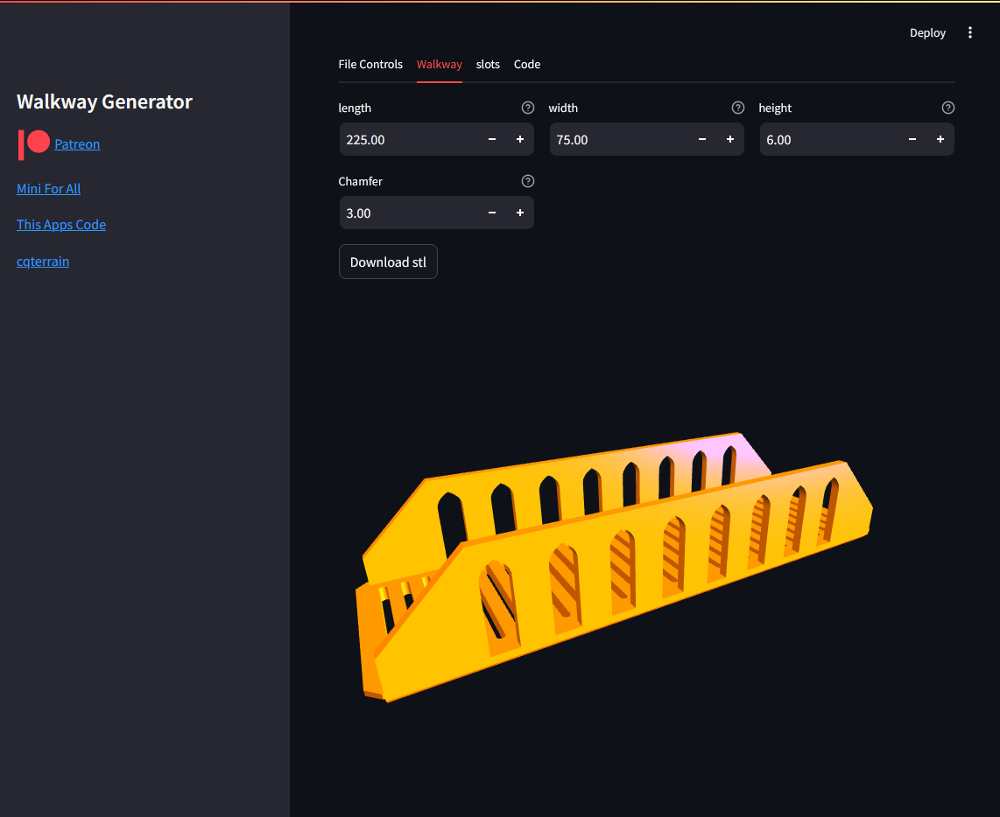

# CadQuery Walkway Generator - Streamlit Gui

 Streamlit App using code from [cqterrain](https://github.com/medicationforall/cqterrain) to generate parametric walkway terrain. 
 
I created this application https://walkwaygenerator.streamlit.app/ to help with the technical barriers and allow for an interactive demo.

The streamlit application allows you to define the dimensions of your walkwy.


[](https://walkwaygenerator.streamlit.app//)

View the demo [walkwaygenerator.streamlit.app](https://walkwaygenerator.streamlit.app//)

### Features
* Modify size and attributes for the walkway
* View the individual models
* Download STL or STEP versions of the models
* Generates the cadquery code which can be run independent of the streamlit application. 
* All of the code is open source and can be run on your own machine.


## To Run Locally

1. Download the code
2. Open a command line where the code resides
3. Install requirements
    ```
    pip install -r requirements
    ```
4. Run the streamlit app
    ```
    streamlit run app/app.py
    ```
5. If everything worked; a browser should be opened to your local instance.